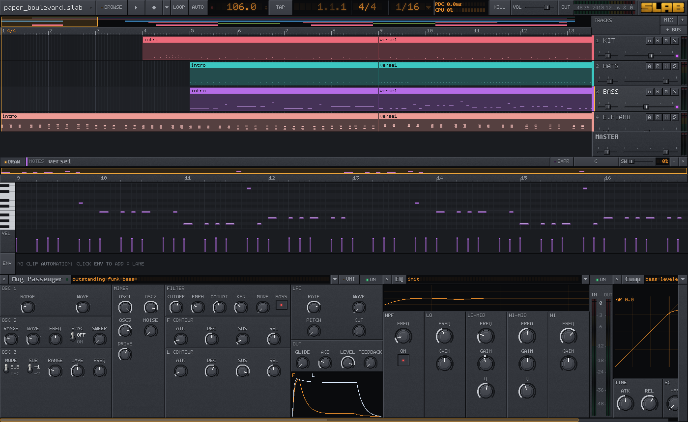
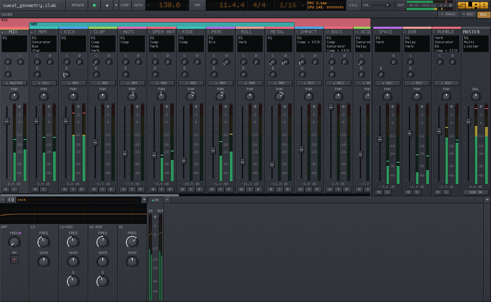

# Slab

**A free music studio for Apple Silicon Macs, where every instrument and
effect is a short file you can open and change.**



Slab (the Slab Audio Workstation) is a complete place to make music: lay
out a song, write parts in the piano roll, play ten instruments through
fifteen effects, automate anything, and mix it down to a WAV. It looks
like a rack of 2000s studio hardware and runs like native code, because
it is.

## What you get

- **Ten instruments with a lineage.** Each is modeled on the instrument
  it's named after:
  - **Mog Passenger**, after the Moog Prodigy and Messenger: three
    oscillators into a driven transistor ladder
  - **FM-7.11**, after the Yamaha DX7: six operators and 32 algorithms;
    it opens your own `.syx` cartridges
  - **Ju-Know**, after the Juno: a DCO polysynth with its chorus
  - **Profit-5**, after the Prophet-5, with POLY-MOD
  - **SM-24 Mono**, after the MS-20 and its screaming filters
  - **Concoction**, a wavetable synth that reads Serum tables, with a
    wavetable editor
  - **Unfairlight TMI**, after the Fairlight CMI: any sample becomes
    8-bit voice RAM, grit included
  - **DS-404**, an 808/909-style drum machine
  - **Rhodes**, a modeled electric piano
  - **Sampler**, for WAV, FLAC, SFZ and folder kits
- **Fifteen effects:** EQ, graphic EQ, compressor, bus compressor,
  multiband, a character compressor, saturator, tape, chorus, delay,
  reverb, gate, limiter, an era (lo-fi) box and a funk overdrive.
- **Sounds that are yours to use.** Factory presets, an FM bank designed
  from scratch, a sampled-voice bank for the Unfairlight, two pianos and
  three drum kits. All CC0: use them in any music, no credit owed.
- **A real studio around them.** Arrangement with clips and folding
  groups, a piano roll with velocity, per-note pitch, pressure and
  slide, automation lanes you can record, buses, sends, sidechain,
  delay compensation, unison on any synth, undo, and export.
- **Sound quality first.** 64-bit audio from oscillator to master,
  filters oversampled where they distort, and renders that come out
  bit-identical however many cores they use.
- **Light on your Mac.** Concoction plays eight voices with everything
  switched on for 3.4% of one M1 Pro core.
- **Change anything.** Every instrument and effect is a text file in
  Slab's own language, fy. Open one, change the filter, save, and the
  next copy you load has the new filter, without restarting Slab and
  without a plugin SDK. Changing one while it plays is on the way.
- **More sounds when you want them.** Download the Versilian Community
  Sample Library (6 GB, free) or classic drum machine packs from inside
  the app, or bring your own Fairlight disks.



## Get it

Slab is in beta. It needs a Mac with Apple Silicon (M1 or later) and
macOS 13 or later.

```bash
brew install --cask nooga/tap/slab
```

Or, without Homebrew:

```bash
curl -fsSL https://github.com/nooga/slab/releases/latest/download/install.sh | bash
```

Or download the DMG from the
[latest release](https://github.com/nooga/slab/releases/latest) and
drag Slab to Applications. Slab isn't notarized yet, so the first time
you open the DMG version, allow it under System Settings > Privacy &
Security > Open Anyway. The two commands above don't need that step.

## Under the hood

Slab is two programs in one. A host written in [Zig](https://ziglang.org)
owns everything that has to be solid: audio I/O, the transport and
clock, the arrangement and piano roll, the mixer and routing, the UI,
projects and undo. Everything that makes sound is a **machine** written
in [fy](fy/), a small concatenative language that lives in this repo.

- **fy compiles to native code as it loads.** A machine's audio path is
  written as `dsp:` words, which fy compiles straight to ARM64, with
  NEON for paired voices and stereo effects. There's no interpreter on
  the audio path and no garbage collector.
- **Hot-patching is a branch swap.** Every fy word sits behind a
  trampoline. Redefining one writes new code and repoints a single
  branch, so the next call runs the new version and every caller
  follows. Today Slab recompiles a machine when its files change on
  disk, and new instances pick it up; carrying the patch into the
  instances already playing is the next step
  ([docs/09-hot-reload.md](docs/09-hot-reload.md)).
- **The audio thread never allocates or locks.** Memory comes from four
  arenas (block, persistent, voice, asset) set up ahead of time, and the
  UI talks to the audio thread over lock-free rings.
- **A machine is a declaration over kernels.** Its file lists
  parameters, panel layout and presets on top of shared kernels:
  oscillators, filters, envelopes, oversamplers. A panel is laid out
  declaratively and drawn by the host in the 1px-bevel house style.
- **Tracks render in parallel, deterministically.** Each track renders
  on a worker pool, and buses are summed in a fixed order, so a render
  is bit-identical at any thread count. A headless bench renders every
  machine against golden hashes on every change.
- **Songs can be code too.** `tools/slabkit` is a Python library for
  writing songs as scripts, rendered offline with `slab --render`. The
  demos in `songs/` are made that way.

### Build from source

You need [Zig](https://ziglang.org) 0.16 or later and raylib
(`brew install raylib`).

```bash
zig build run     # build and run Slab
zig build test    # the unit tests
zig build bench -- machines/fm86   # render a machine headless, with a report
```

`tools/package_app.sh` builds `Slab.app` (and `--dmg`, `--zip`);
`tools/release.sh` publishes a release and updates the Homebrew cask.

To go deeper, start with [docs/README.md](docs/README.md): the design
docs are the plan, and code follows them. The fy language for machines
is in [docs/18-fy-dsp-language.md](docs/18-fy-dsp-language.md), and
writing a machine in [docs/02-machines.md](docs/02-machines.md).

## Contributing

Pull requests are welcome. Read [CONTRIBUTING.md](CONTRIBUTING.md)
first; the CLA bot asks you to sign the
[Contributor License Agreement](CLA.md) on your first one.

## License

Slab is free software: [GPL-3.0-or-later](LICENSE), with the Slab Machine
Exception, which lets people share the machines, presets, projects and
packs they make under terms of their choice. Factory presets, sounds and
demos are [CC0](LICENSES/CC0-1.0.txt). The name "Slab", the wordmark and
the icon are not licensed; a fork needs its own.
[COPYING.md](COPYING.md) has the details and [NOTICE](NOTICE) the
third-party credits.
